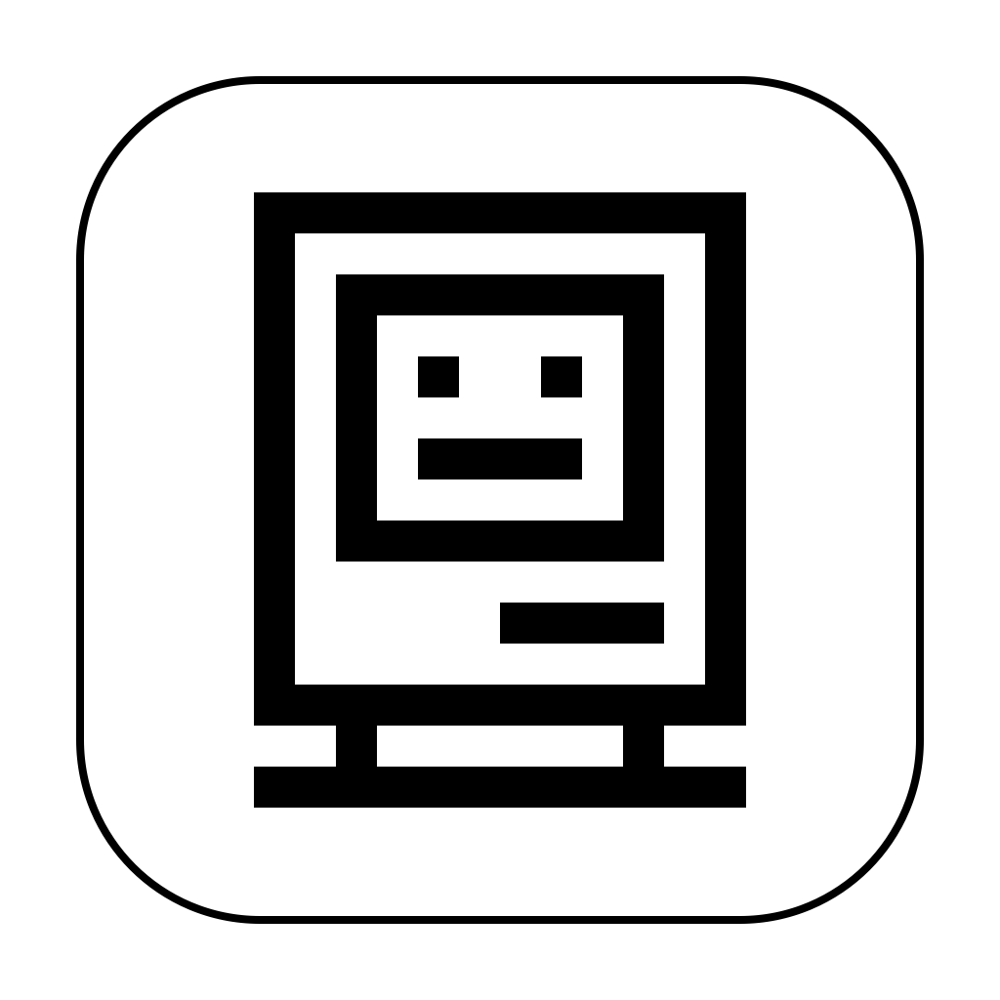
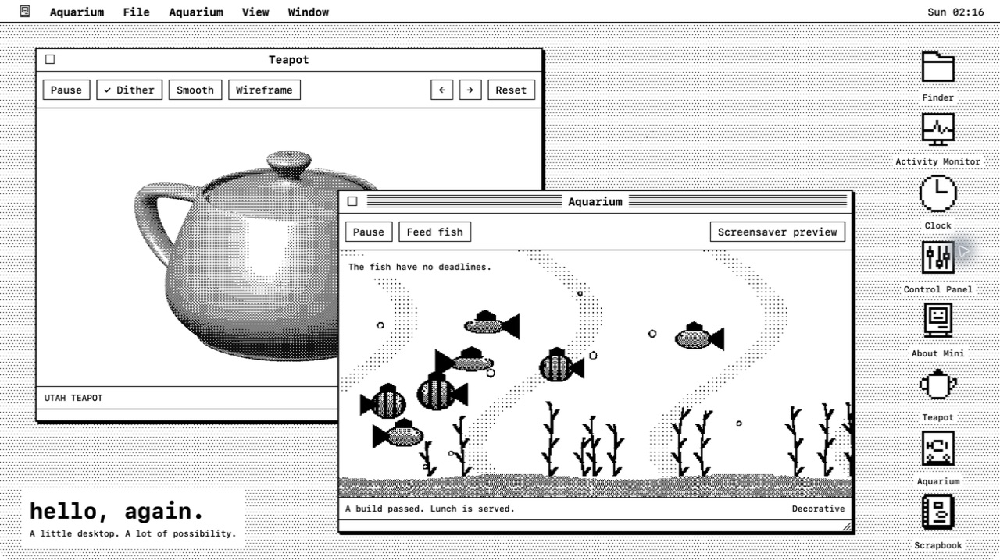

# Hello Mini



A tiny Macintosh desktop with a deeply unreasonable amount of modern capability. Real utilities, monochrome Metal spectacles, and fish that get lunch when your builds pass.

**Apple silicon · macOS 26+ · MIT licensed**

[Website](https://hellomini.app) · [Download](https://github.com/emmettl/hellomini/releases/latest) · [Installation](docs/INSTALL.md) · [User guide](docs/USER_GUIDE.md) · [Roadmap](ROADMAP.md)



## Get Hello Mini

Download the signed and Apple-notarized ZIP from [GitHub Releases](https://github.com/emmettl/hellomini/releases/latest), expand it, move **Hello Mini.app** to Applications, and open it. No Xcode or developer account is needed.

The desktop is designed around 1280 × 720, including small displays such as the Wokyis M5 retro docking station. Optional **Purist mode** runs at a fixed 512 × 384 logical resolution. See [installation and updates](docs/INSTALL.md) for requirements, source builds, and saved data. Homebrew distribution remains planned.

## A little look inside

- **Useful:** Finder, Find File, Activity Monitor, Clock, Alarm Clock, World Clock, Key Caps, Clipboard, Scrapbook, Desk Calculator, Chooser, Disk First Aid, and Wastebasket.
- **Questionably useful:** Print Monitor turns GitHub Actions and GitLab builds into imaginary print jobs. Failures jam the printer; successful builds can feed the fish.
- **Gloriously unnecessary:** a Metal Utah Teapot, Aquarium, a sliding Puzzle made from the live desktop, and original Flying Toasters screensavers.
- **Five appearances:** Classic, Paper, Midnight, System 7, and early Aqua, complete with pinstripes, gel controls, traffic lights, and a dock with magnification and launch bounce.

Windows move, resize, minimise, and remember their layout. Control Panel selects the theme, screensaver, and optional silliness. Effects respect Reduce Motion and pause when hidden. The [user guide](docs/USER_GUIDE.md) covers controls, keyboard shortcuts, application behaviour, and limitations.

## But why, though?

Because charm is sometimes more important than practicality. Hello Mini is an homage to the early Macintosh with capabilities that would have been utterly impossible on the original hardware. Creeping anachronism is part of the point.

The [roadmap](ROADMAP.md) collects the next contributions to the project's quintessential idiocy. An independent homage; not affiliated with Apple or the creators of After Dark.

## Running the first desktop

For source development, use macOS 26 with Xcode 26.6 or another Swift 6.3+ toolchain. Open `Package.swift` in Xcode, or run:

```sh
make run     # Build a local app bundle and launch it
make check   # Lint, test, check build/release tooling, and build
make format  # Apply swift-format
```

`make app` produces an ad-hoc-signed `dist/Hello Mini.app`. See [Contributing](CONTRIBUTING.md) for development checks and [Releasing](docs/RELEASING.md) for public signing and notarization.

## Applications and architecture

Applications are SwiftPM targets using `MiniCore` and shared `MiniUI` controls. `MiniDesktop` owns windows, focus, menus, and launching; the executable registers applications and connects them. The stack is SwiftUI, AppKit, Metal, Swift Testing, and `swift-format`. All applications are compiled into the app today; the external binary plugin model remains undecided.

See the [architecture guide](docs/ARCHITECTURE.md) for module boundaries, theme extension points, resource bundles, persistence, and graphics lifecycle.

## Documentation

- [Installation and updates](docs/INSTALL.md)
- [User guide](docs/USER_GUIDE.md)
- [Changelog](CHANGELOG.md) and [roadmap](ROADMAP.md)
- [Contributing](CONTRIBUTING.md) and [architecture](docs/ARCHITECTURE.md)
- [Build CI](docs/CI.md) and [releasing](docs/RELEASING.md)
- [Website maintenance](website/README.md)

## License

Hello Mini is [MIT licensed](LICENSE). Imported teapot data retains its original permission notice; see [third-party notices](THIRD_PARTY_NOTICES.md). Both notices ship inside the app bundle.
